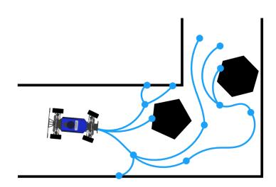

# **COSC494/594 Project 4 - Path Planning**

Instructor: Fei Liu [fliu33@utk.edu](mailto:fliu33@utk.edu) TA: Farong Wang [fwang31@vols.utk.edu](mailto:fwang31@vols.utk.edu) University of Tennessee, Knoxville



**Figure 1:** Path Planning

# **Q1. Roadmap Construction**

In this question, we implement the core components required for sampling-based motion planning. The goal is to construct a roadmap by generating collision-free samples in the configuration space and connecting them into a graph structure for path planning.

We consider a robot configuration space:

C

where each configuration is represented as:

$$\mathbf{x} = (x, y)$$

for planar motion planning (without considering orientation *θ* yet). We only consider a planar configuration space rather than the full *SE*(2) configuration space for Q1. The roadmap consists of:

$$G = (V, E)$$

where:

- *V* represents sampled configurations (vertices)
- *E* represents valid connections (edges)

The planner will later use graph search algorithms such as A\* to compute feasible paths through this roadmap.

#### **Halton Sampling**

To generate well-distributed samples in the configuration space, we use the Halton low-discrepancy sequence. Unlike purely random sampling, Halton sampling generates deterministic samples that more uniformly cover the space. Each dimension maintains its own prime-number base:

$$b_1, b_2, \ldots, b_n$$

The Halton sequence for sample index *k* in base *b* is computed using the radical inverse function:

$$H_b(k) = \sum_{i=0}^m \frac{a_i}{b^{i+1}}$$

where:

$$k = a_0 + a_1 b + a_2 b^2 + \dots + a_m b^m$$

is the base-*b* representation of *k*. Here, *a<sup>i</sup>* denotes the *i*-th digit of *k* in base *b*, and *m* is the highest digit index such that *a<sup>m</sup>* ̸= 0.

The generated value satisfies:

$$H_b(k) \in [0,1]$$

Here, the index *k* corresponds to the ID of the sampled point:

$$k = 0, 1, 2, \dots$$

Each sample index produces one deterministic configuration:

$$\mathbf{x}^{(k)} = (H_{b_1}(k), H_{b_2}(k), \dots)$$

For a 2D planning problem, we commonly use:

$$b_x = 2, \qquad b_y = 3$$

Thus, the sampled configuration becomes:

$$\mathbf{x}^{(k)} = (H_2(k), H_3(k))$$

## *Examples*

*Case (1)* For example, let:

$$k=5, \qquad b=2$$

Then, the binary representation of 5 is:

$$5 = 1 + 0 \cdot 2 + 1 \cdot 2^2$$

Thus:

$$a_0 = 1,$$
  $a_1 = 0,$   $a_2 = 1,$   $m = 2$ 

and the Halton value becomes:

$$H_2(5) = \frac{1}{2} + \frac{0}{2^2} + \frac{1}{2^3} = \frac{5}{8}.$$

*Case (2)* For another example, let:

$$k = 50, \qquad b = 3$$

The base-3 representation of 50 is:

$$50 = 2 + 1 \cdot 3 + 2 \cdot 3^2 + 1 \cdot 3^3$$

Thus:

$$a_0 = 2,$$
  $a_1 = 1,$   $a_2 = 2,$   $a_3 = 1,$   $m = 3$ 

The Halton value becomes:

$$H_3(50) = \frac{2}{3} + \frac{1}{3^2} + \frac{2}{3^3} + \frac{1}{3^4}$$

$$= \frac{2}{3} + \frac{1}{9} + \frac{2}{27} + \frac{1}{81} = \frac{70}{81}.$$

#### **Q1.1: Implementation of Halton Sampling**

Complete the HaltonSampler class in:

src/proj4/proj4/samplers.py

The HaltonSampler uses a separate base for each dimension of the configuration space. The method compute\_sample should return a deterministic value in the range [0*,* 1] for a given sample index *k* and base *b*. The sample index *k* can be interpreted as the ID of the sampled point. In this project, the implementation shifts the index by one:

$$k \leftarrow k+1$$

so that the first zero-indexed sample does not return the origin:

$$H_b(0)=0.$$

The returned values are later scaled by the sample method to match the configuration-space extents. A value of 0 corresponds to the lower bound, while a value of 1 corresponds to the upper bound.

*Implementation*:

```
# BEGIN QUESTION 1.1
```

Please fill your code here.

#### *# END QUESTION 1.1*

- Implement compute\_sample & sample
- Use the Halton sequence to generate deterministic samples
- Use a different base for each configuration-space dimension
- Linearly scale samples to the configuration-space bounds

#### *Submission Requirement:*

After completing Q1.1, visualize your Halton samples using:

python3 ./src/proj4/proj4/plot\_roadmap.py --num-vertices 100 --lazy

Submit the generated plot together with your code.

#### **Q1.2: Implementation of State Validity Checking**

Implement state validity checking in:

src/proj4/proj4/problems.py

In this question, you will complete the method:

PlanarProblem.check\_state\_validity

This function determines whether a batch of sampled states is collision free. It will be used extensively during roadmap construction for:

- sampled roadmap vertices
- interpolated states along roadmap edges

Therefore, your implementation should be vectorized and efficient.

For this question, we consider a planar configuration space:

$$\mathbf{x} = (x, y)$$

without considering orientation *θ* yet (i.e., not the full *SE*(2) configuration space).

A state is considered valid only if:

1. the state lies within the configuration-space bounds:

$$x_{\min} \le x \le x_{\max}, \qquad y_{\min} \le y \le y_{\max}$$

2. the corresponding location lies inside the collision-free region:

$$(x,y) \in \mathcal{P}$$

Here,

$$\mathcal{P} = \texttt{PlanarProblem.permissible\_region}$$

denotes the collision-free occupancy grid of the environment.

For simplicity, we assume the robot is a point robot. Therefore, each state only needs to check a single occupancy-grid entry in the permissible region.

Implementation:

```
# BEGIN QUESTION 1.2
```

Please fill your code here.

```
# END QUESTION 1.2
```

- Implement PlanarProblem.check\_state\_validity
- Vectorize collision checking for batches of states
- Verify states lie within PlanarProblem.extents
- Verify states lie inside the collision-free PlanarProblem.permissible\_region

*Submission Requirement:*

After completing Q1.2, visualize your Halton samples using:

```
python3 ./src/proj4/proj4/plot_roadmap.py \
            --text-map ./src/proj4/maps/map1.txt \
            --num-vertices 100 --lazy
```

Submit the generated plot together with your code.

# **Q1.3: Implementation of Edge Validity Checking**

Implement edge validity checking in:

```
src/proj4/proj4/roadmap.py
src/proj4/proj4/problems.py
```

Firstly, you will complete the method:

Roadmap.check\_weighted\_edges\_validity

This function is called by the Roadmap constructor before adding edges to the graph. Its purpose is to remove invalid edges that pass through obstacles.

Given two roadmap vertices:

$$\mathbf{x}_i = (x_i, y_i), \qquad \mathbf{x}_j = (x_j, y_j),$$

an edge between them is valid only if the straight-line path connecting them is collision-free. To check whether an edge is collision free, interpolate a sequence of states along the straight-line connection between two vertices using:

R2Problem.steer

The interpolated states are computed as:

$$\mathbf{x}(\alpha) = (1 - \alpha)\mathbf{x}_i + \alpha\mathbf{x}_j, \qquad \alpha \in [0, 1].$$

Then use PlanarProblem.check\_state\_validity to verify that all interpolated states along the edge lie inside the collision-free region.

Implementation:

```
# BEGIN QUESTION 1.3
```

Please fill your code here.

```
# END QUESTION 1.3
```

- Implement R2Problem.steer to generate interpolated states along a straight-line connection between two configurations
- Implement Roadmap.check\_weighted\_edges\_validity
- For each candidate edge, call self.problem.steer to obtain interpolated states along the edge
- Use check\_state\_validity to collision-check all interpolated states
- Return only edges whose entire straight-line connection is collision free

#### *Submission Requirement:*

After completing Q1.3, visualize your Halton samples using:

```
python3 ./src/proj4/proj4/plot_roadmap.py \
            -m ./src/proj4/maps/map1.txt \
            -n 25 -r 3.0 --show-edges
```

Submit the generated plot together with your code.

#### **Q2. Graph Search**

# **Q2.1: Implementation of A\* Search**

Implement the main A\* search logic in:

src/proj4/proj4/search.py

In this question, you will complete the A\* planner. A\* searches over the roadmap graph to find a low-cost path from the start node to the goal node.

For each expanded node, the planner checks its neighboring nodes. For each neighbor, compute the cost-to-come through the current node:

$$g(n_{\mathrm{neighbor}}) = g(n_{\mathrm{current}}) + c(n_{\mathrm{current}}, n_{\mathrm{neighbor}})$$

where *c*(*n*current*, n*neighbor) is the edge length between the current node and the neighbor.

Then compute the A\* priority value:

$$f(n_{\rm neighbor}) = g(n_{\rm neighbor}) + h(n_{\rm neighbor}, n_{\rm goal})$$

where *h*(·) is the heuristic distance to the goal (i.e., cost-to-go).

Each neighbor should be inserted into the priority queue using a QueueEntry, which stores the node, its cost-to-come, its priority value, and its parent pointer.

After the goal node is expanded, implement extract\_path to follow the parent pointers backward from the goal to the start. The final returned path should list the nodes in order from start to goal. Implementation:

```
# BEGIN QUESTION 2.1
```

Please fill your code here.

#### *# END QUESTION 2.1*

- Implement the main A\* expansion logic
- For each neighbor, compute the new cost-to-come through the current node
- Compute the A\* priority value using cost-to-come plus heuristic
- Insert a QueueEntry into the priority queue
- Implement extract\_path using parent pointers
- Return the final node sequence from start to goal

#### Submission Requirement:

After completing Q2.1, run an A\* planner from start (1*,* 1) to goal (7*,* 8) using:

```
python3 ./src/proj4/proj4/run_search.py \
       -m ./src/proj4/maps/map1.txt -n 25 -r 3.0 --show-edges r2 -s 1 1 -g 7 8
```

Submit the generated plot together with your code.

#### **Q2.2: Implementation of Lazy A\* Search**

Implement Lazy A\* in:

src/proj4/proj4/search.py

In standard A\*, all edges in the roadmap are assumed to be valid before search begins. In Lazy A\*, edge collision checking is delayed until the search actually needs to use an edge.

The Roadmap class uses the field:

Roadmap.lazy

to determine whether edges are collision-checked during roadmap construction. You will use the same field inside A\* to decide whether edge validity should be checked lazily during search.

When a node is expanded, the edge from its parent node to the current node must be checked using:

Roadmap.check\_edge\_validity

If this edge is in collision, the current queue entry should be discarded and search should continue with the next queue entry. If the edge is collision free, then the algorithm proceeds as in standard A\*.

Implementation:

```
# BEGIN QUESTION 2.2
```

Please fill your code here.

```
# END QUESTION 2.2
```

- Implement Lazy A\* in search.py
- Use Roadmap.lazy to determine whether lazy edge checking is needed
- When expanding a node, collision-check the edge from its parent to the current node
- Use Roadmap.check\_edge\_validity for lazy edge validation
- Discard the queue entry if the parent-to-current edge is in collision
- Continue standard A\* expansion if the edge is collision free

Submission Requirement: After completing Q2.2, run Lazy A\* using:

```
python3 ./src/proj4/proj4/run_search.py \
       -m ./src/proj4/maps/map1.txt \
       -n 25 -r 3.0 --lazy --show-edges r2 -s 1 1 -g 7 8
```

Note that some roadmap edges may pass through obstacles because they were not collisionchecked during roadmap construction. Submit the generated plot together with your code.

# **Q2.3: Implementation of Path Shortcutting**

Implement path shortcutting in:

src/proj4/proj4/search.py

A\* returns the shortest path on the roadmap graph. However, this graph path is not necessarily the shortest collision-free path in the environment, because the roadmap only contains a limited set of sampled vertices and edges. Path shortcutting improves the returned path by attempting to directly connect non-adjacent states on the path.

Given a path:

$$\mathbf{x}_1, \mathbf{x}_2, \ldots, \mathbf{x}_K,$$

randomly select two indices *i* and *j*, where:

$$1 \le i < j \le K.$$

Then check whether the direct connection:

$$\mathbf{x}_i \to \mathbf{x}_j$$

is collision free. This direct shortcut is accepted only if:

- 1. the shortcut edge is collision free
- 2. the direct connection is shorter than the original path segment from *i* to *j*

The original segment:

$$\mathbf{x}_i, \mathbf{x}_{i+1}, \dots, \mathbf{x}_j$$

is then replaced by the shortcut, i.e., **x***<sup>i</sup>* → **x***<sup>j</sup>* directly.

Importantly, the shortcut edge does not need to already exist in the roadmap graph (i.e., may not be an existed edge in the graph). It only needs to be valid in the environment.

Implementation:

```
# BEGIN QUESTION 2.3
```

Please fill your code here.

```
# END QUESTION 2.3
```

- Implement path shortcutting in search.py
- Randomly select two non-adjacent path indices
- Use edge collision checking to verify that the shortcut is valid
- Compare the shortcut length against the original path segment length
- Replace the original path segment only when the shortcut is valid and shorter

#### Submission Requirement:

After completing Q2.3, run path shortcutting using:

```
python3 ./src/proj4/proj4/run_search.py \
       -m ./src/proj4/maps/map1.txt \
       -n 25 -r 3.0 --lazy --shortcut --show-edges r2 -s 1 1 -g 7 8
```

Your generated plot may varies because shortcutting uses random pairs of path states. Note that shortcut edges may directly connect states that were not connected (existed) in the original roadmap graph. Submit the generated plot together with your code.

### **Q3. MobileCar Planning**

So far, we have considered R2Problem, where each configuration only contains planar position:

$$\mathbf{x} = (x, y).$$

However, the MobileCar car also has an orientation. Therefore, we now consider an SE2Problem, where each configuration is:

$$\mathbf{x} = (x, y, \theta).$$

where:

- *x, y*: planar position
- *θ*: robot orientation

# **Q3.1: Implementation of Dubins Path Normalization**

Implement the Dubins path planning wrapper in:

src/proj4/proj4/dubins.py

In this question, you will complete:

path\_planning(start, end, curvature, resolution, interpolate\_line)

The function connects two SE2 configurations:

$$\mathbf{x}_{\mathsf{start}} = (x_s, y_s, \theta_s), \qquad \mathbf{x}_{\mathsf{goal}} = (x_g, y_g, \theta_g).$$

The provided Dubins solver assumes the start configuration is at the origin:

(0*,* 0*,* 0)*.*

Therefore, before calling path\_planning\_from\_origin, you must transform the goal configuration into the local coordinate frame of the start configuration.

First, translate the goal position relative to the start:

$$\mathbf{p}' = \begin{bmatrix} x_g - x_s \\ y_g - y_s \end{bmatrix}.$$

Then rotate it into the start frame:

$$\mathbf{p}_{\mathsf{local}} = R(\theta_s)\mathbf{p}'.$$

The goal orientation is also expressed relative to the start:

$$\theta_{\text{local}} = \theta_g - \theta_s$$
.

After computing the Dubins path in the local frame, transform the path back to the global frame using the inverse rotation:

$$\mathbf{p}_{\text{global}} = R(-\theta_s)\mathbf{p}_{\text{local}} + \begin{bmatrix} x_s \ y_s \end{bmatrix}.$$

# Implementation:

```
# BEGIN QUESTION 3.1
```

Please fill your code here.

#### *# END QUESTION 3.1*

- Convert start and end to NumPy arrays
- Transform the goal into the local frame of the start configuration
- Call path\_planning\_from\_origin
- Transform the resulting path back to the global frame
- Normalize heading angles using pi\_2\_pi
- Return the path and real Dubins path length

## Submission Requirement:

After completing Q3.1, run Lazy A\* for the SE2Problem using:

```
python3 ./src/proj4/proj4/run_search.py \
       -m ./src/proj4/maps/map1.txt \
       -n 40 -r 4 --lazy --show-edges se2 -s 1 1 0 -g 7 8 45 -c 3
```

Shortcutting should further reduce the overall path length by directly connecting collision-free configurations along the planned trajectory.

```
python3 ./src/proj4/proj4/run_search.py \
       -m ./src/proj4/maps/map1.txt \
       -n 40 -r 4 --lazy --shortcut --show-edges se2 -s 1 1 0 -g 7 8 45 -c 3
```

Note that some edges are in collision. Submit the generated plot together with your code.

#### **Q4. Running on ROS 2 with a Map**

After finishing above, in this question, you will run the planner in the ROS 2 simulation environment with a map. Launch the car simulation using:

• **Step 1: Launch the simulation environment**

Open a terminal and run:

```
ros2 launch proj4 launch_car_sim_proj4.py
```

#### • **Step 2: Enable autonomous mode**

Press and hold the R1 bumper on the controller to switch the vehicle into autonomous mode. Open a new terminal and run:

```
ros2 run mushr_sim keyboard_teleop_terminal
```

**Important:** Press p on your keyboard to switch the control mode to AUTO. This allows your controller to take over the vehicle.

#### • **Step 3: Set the navigation goal**

In RViz, use the 2D Goal Pose tool to specify the goal pose on the map.

#### • **Step 4: Execute planning and navigation**

Once the goal pose is specified, the planner will automatically compute a collision-free path. The vehicle should begin navigating toward the destination after planning completes.

**Optional Exploration:** Students are encouraged to experiment with the planner parameters inside the planner\_node launch configuration:

```
src/proj4/launch/launch_car_sim_proj4.py
```

```
planner_node = Node(
    package="proj4",
    executable="planner_node",
    name="planner_node",
    output="screen",
    parameters=[
        {
            "num_vertices": 500,
            "connection_radius": 10.0,
            "curvature": 1.0,
            "cache_roadmap": False,
        }
    ],
)
```

In particular, try varying:

- num\_vertices: number of sampled roadmap vertices
- connection\_radius: maximum edge connection distance
- curvature: vehicle turning curvature

Observe how these parameters affect:

- roadmap connectivity (not yet visualized in Rviz in default),
- planning time,
- path smoothness,
- and overall navigation performance.

# Submission Requirement:

Submit a screen recording (in video format, mp4 etc) from RViz showing:

- the map,
- the initial pose,
- the goal pose,
- the planned path,
- and the car moving in autonomous mode.

# **Q5. Extra Credit: Rapidly Exploring Random Tree (Optional)**

In this extra-credit question, you will implement Rapidly Exploring Random Tree (RRT), a samplingbased planning algorithm that incrementally builds a search tree from the start configuration toward randomly sampled states.

Unlike roadmap-based planning, RRT does not first construct a full graph. Instead, it repeatedly:

- samples a random configuration,
- finds the nearest existing tree vertex,
- extends the tree toward the sample,
- and adds the new state if the state and edge are valid.

# **Q5.1: Implementation of RRT**

Implement the main RRT logic in:

src/proj4/proj4/rrt.py

Initialize an RRTTree using the start configuration:

**x**start*.*

At each iteration, draw a random sample:

**x**rand*,*

find the nearest vertex in the current tree:

**x**near*,*

and extend the tree from **x**near toward **x**rand using step size:

*ϵ.*

This produces a candidate new state:

**x**new*.*

The new state should be added to the tree only if:

1. **x**new is collision free,

2. and the edge from **x**near to **x**new is collision free.

If the new state satisfies the goal criterion, the planner can terminate and return the path. Implementation:

```
# BEGIN QUESTION 5.1
```

Please fill your code here.

```
# END QUESTION 5.1
```

The following functions may be useful:

- sample
- extend
- rm.problem.check\_state\_validity
- rm.problem.check\_edge\_validity
- rm.problem.goal\_criterion
- tree.AddVertex
- tree.AddEdge
- tree.GetNearestVertex

Plain RRT does not optimize path cost during expansion. Therefore, you can set the edge cost to:

0*.*

The final path cost will be computed after the search terminates.

#### Submission Requirement:

After completing Q5.1, run an RRT planner for the R2Problem using:

```
python3 ./src/proj4/proj4/run_search.py \
       -m ./src/proj4/maps/map1.txt \
       --algorithm rrt -x 1000 -e 0.5 -b 0.05 --show-edges r2 -s 1 1 -g 8 7
```

Due to the stochastic nature of RRT sampling, your generated plot may look slightly different every time. Submit the generated plot together with your code.